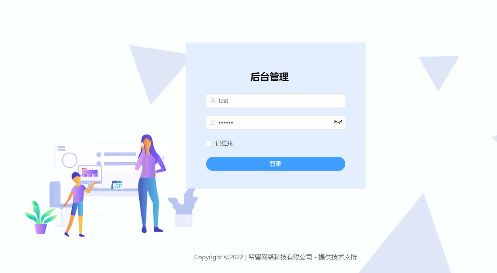
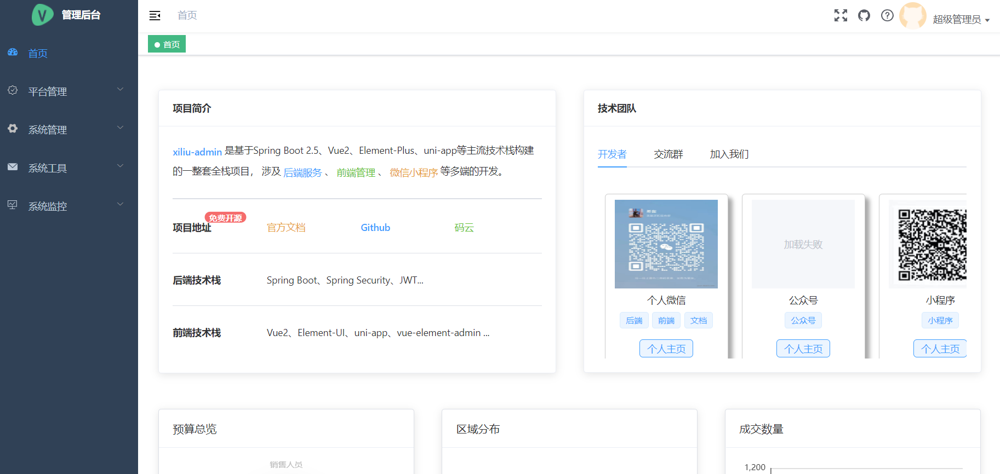

# xiliu-tenant-ui

> 这是一个基于vue-admin-template 4.0.0搭建的后台管理系统。它只包含了 Element UI & axios & iconfont & permission control & lint，这些搭建后台必要的东西。


## Build Setup

```bash
# 克隆项目


# 进入项目目录
cd xiliu-admin-web

# 安装依赖
npm install

# 建议不要直接使用 cnpm 安装以来，会有各种诡异的 bug。可以通过如下操作解决 npm 下载速度慢的问题
npm install --registry=https://registry.npm.taobao.org

# 启动服务
npm run dev
```

浏览器访问 [http://localhost:9528](http://localhost:9528)

## 发布

```bash
# 构建测试环境
npm run build:stage

# 构建生产环境
npm run build:prod
```

## 其它

```bash
# 预览发布环境效果
npm run preview

# 预览发布环境效果 + 静态资源分析
npm run preview -- --report

# 代码格式检查
npm run lint

# 代码格式检查并自动修复
npm run lint -- --fix
```
# 开发规约

## 命名规则

Component：
- 所有的Component文件都是以大写开头，除了index.vue。 组件名name 采用首字母大写，避免产生冲突。
例如：@/src/layout/components/Sidebar/index.vue
      @/src/layout/components/Sidebar/Item.vue
      
JS 文件
- 所有的.js文件都遵循横线连接 (kebab-case)

Views
- 在views文件下，代表路由的.vue文件都使用横线连接 (kebab-case)，代表路由的文件夹也是使用同样的规则

使用横线连接 (kebab-case)来命名views主要是出于以下几个考虑。

- 1.横线连接 (kebab-case) 也是官方推荐的命名规范之一
- 2.views下的.vue文件代表的是一个路由，所以它需要和component进行区分(component 都是大写开头)
- 3.页面的url 也都是横线连接的，比如https://www.xxx.admin/export-excel，所以路由对应的view应该要保持统一
- 4.没有大小写敏感问题


## 项目效果



